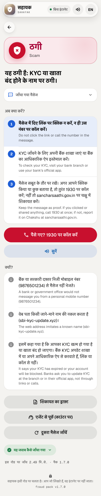
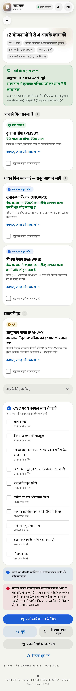

# Sahayak · सहायक

**An offline scam shield and benefits guide for people who are new to digital money.**
Sahayak runs on one small computer (the "node") at a CSC or bank-agent counter. Phones join its
Wi-Fi, which has no internet, and get two things in Hindi or English, by voice or by touch:

- **"Is this a scam?"** Paste, speak, photograph or describe a message, a call or a UPI QR code. A verdict
  in milliseconds (Scam, Suspicious, No scam signs, or Could not check), the three reasons behind it, what to do
  next, and a complaint draft. Lost money: call 1930 at once. An attempt with no loss: report it on Chakshu
  (sancharsaathi.gov.in). "No scam signs" never says "safe". A message mostly in a language Sahayak cannot read yet
  gets "Could not check" and safe-default advice, not a false green.
- **"What am I owed?"** A short spoken interview (median 5 questions) finds which of 12 central schemes
  (old-age, widow and disability pensions, PMSBY, PMJJBY, APY, PM-KISAN, PM-JAY, e-Shram, PM-SYM, Jan Dhan…)
  the person can get, with the papers to carry, where to go, what to say at the counter, and a printed slip.
  Health comes first: Ayushman Bharat (PM-JAY) pays up to ₹5 lakh a year for treatment on admission to a listed
  hospital, not for OPD visits; at 70 or older it is the Vay Vandana card, whose cover is shared with a spouse who
  is also 70 or older.

Nothing a person types or says leaves the node. The node page shows it live: outbound connections
and DNS lookups by Sahayak, open internet connections on the machine, and whether the firewall blocks
the internet.

**At home, too.** Scam calls and messages arrive at home, not at the counter. A phone that has opened Sahayak's
secure web address once (the public site below today; the node's own address after a one-time HTTPS setup,
`docs/NODE_HTTPS.md`) keeps its own copy of the scam check and the benefits interview (the same rules, from the same
signed packs) and answers by itself, with no node and no internet; nothing leaves the phone. The phone's answers match
the node's on every benchmark case (`bench/results/phone_parity.md`). A stand-alone build of the app runs from any
HTTPS site, offline after the first visit: **try it at https://roshworldwide.github.io/optum-v2/**
(`python scripts/build_tryit.py`).

Built for Ideas for India 2026 (Times of India × Optum) by Roshan Raj and Ishmiit Singh. Prototype due 8 Oct 2026;
Grand Jury Round in Delhi on 14 Oct; the Grand Finale on 22 Oct is only for teams selected at the jury round.

| | |
| --- | --- |
|  |  |
| A fake KYC SMS: verdict, reasons, steps, 1930 | A 67-year-old widow: pensions and cover she can claim |

## What is in the box

| Part | What it does | Where |
| --- | --- | --- |
| Fraud-Shield | 52 named signals from a signed content pack (lookalike links, `.bank.in` rule, UPI collect and "scan to receive", OTP or PIN asks with negation handling, digital arrest, fake customer care, "pay to get your scheme card", 1600-series and TRAI sender rules…), a pattern matcher and a small classifier. Four answers: Scam, Suspicious, No scam signs, and Could not check, for a message mostly in a language Sahayak cannot read yet (Bengali, Tamil, Telugu, Kannada, Malayalam, Gujarati, Punjabi, Odia, Urdu, Santali, Manipuri or Marathi); signs it can read still count, so a Tamil message with a scam link is still Scam. Vetted Hindi and English templates explain every verdict; an optional local LLM (off by default) may add a sentence and can only raise a verdict, never lower it. | `sahayak/fraud/`, `packs/fraud.v1.json` |
| Safety gate | Every model sentence is checked for forbidden advice, wrong numbers or links, verdict contradictions, invented amounts and script, in each language, before anyone sees it | `sahayak/safety/gate.py` |
| Benefits Navigator | Scheme rules as data (each with its official source and date), evaluated with yes / likely / unknown / no logic; asks only questions that can still change an answer; never more than 8. Results lead with health cover: PM-JAY pays for hospital admission, not OPD, and the 70+ Vay Vandana cover is shared with a spouse who is also 70+. Pension amounts are the centre's share ("your state may add more"), and a person gets one NSAP pension | `sahayak/navigator/`, `packs/schemes.v1.json` |
| Voice | Offline Hindi and English speech out (every fixed sentence pre-synthesised) and speech in; amounts spoken as words; "I heard …, is that right?" | `sahayak/voice/`, `packs/voice.v1.json` |
| On the phone | The scam check and the benefits interview in the browser, from the packs the node serves (`/phone-packs/`) and the service worker keeps; identical answers to the node, checked case by case; the phone says when its scam patterns are getting old. Benefits results lead with health cover (Ayushman Bharat; the Vay Vandana card for anyone 70+). Offline copies need a secure (HTTPS) address | `web/checker.js`, `web/navigator.js`, `web/sw.js`, `scripts/build_tryit.py` |
| More ways in | Call descriptions, photographed UPI QR codes ("a QR never brings money in"), screenshots read offline | `sahayak/inputs/` |
| Operator console | PIN-protected: "Ask the agent" queue, assisted checks read aloud, consented and encrypted case log, 58 mm slips, impact counters with a signed export that holds no personal data ("rupees at risk" counts the money a message asks for, not the largest amount it names) | `/app/console.html`, `sahayak/node/` |
| Node and proof | Zero-egress monitor, captive-portal DNS, HTTPS with redirect, firewall scripts, Ed25519-signed packs with install and rollback, hashes of every model and pack | `/app/node.html`, `sahayak/node/`, `scripts/firewall/` |

## Evidence

Every number we quote comes from a script in `bench/`; its report is in `bench/results/`, and what changed because of
it is in `PROGRESS.md`. For the scam tests we quote first runs; fixes made after a run are logged, not hidden. The
summary is in
**[docs/TESTING_REPORT.md](docs/TESTING_REPORT.md)**: scam detection with 95% confidence intervals against a keyword
blocklist, scheme rules checked against a separate re-derivation by the same author, Hindi speech recognition on a
public test set, voice latency, screenshot reading, a red team of disguised scams, a blind red team, an AI-model
baseline, the phone-versus-node parity check, and the limits of each.

Added on 7 Oct:

- **Real published messages (PublicBench v0).** 137 messages people in India received, as published by the Income Tax
  portal, PIB Fact Check, consumer courts and fact-checkers (`bench/public/`), gathered by an AI research agent that never
  saw the code, scored once on fraud pack 1.5.0. In Hindi, English and Hinglish: 67 of 97 scams caught (69%) and 11 of 34
  genuine messages flagged (32%); a keyword blocklist caught 62 and flagged 17. The 6 scams in other languages got
  "could not check". Real messages are harder than our own, and this is the number we lead with. The set is split in
  two by a fixed hash: fixes may learn from one half, and the other half stays unread to measure them fairly. After
  the fixes (fraud packs 1.6.0 and 1.7.0), the unread half went from 28 to 31 of 44 scams caught, with genuine messages
  flagged unchanged at 6 of 20: fixing specific misses generalises only a little, which is why real messages at scale
  come next.
- **Blind red team.** 182 messages written by a separate AI model that never saw the code, scored once on fraud pack 1.5.0. In Hindi,
  English and Hinglish: 92 of 103 scams caught (89%) and 14 of 59 hard genuine messages flagged (24%); a keyword
  blocklist caught 51 and flagged 25. In other Indian languages: 5 of 15 scams still caught, the other 10 "could not
  check", no false green. Misses included scams that are still only a story (no link, number or code yet) and a USSD
  call-forwarding trick; false alarms included a delivery OTP given at the door and bank credit and debit alerts with
  an "SMS BLOCK" line (`bench/results/redteam_v1_blind.md`).
- **An AI model as the judge.** qwen2.5:3b, zero-shot, on the dev Mac's GPU (Apple M3). On the blind set it caught
  108 of 118 scams (92%) but flagged 24 of 64 genuine messages (38%), at 2.24 s a message; Sahayak caught 97 (82%)
  and flagged 15 (23%), in 1.76 ms. The model did better on the other Indian languages: 14 of 15 scams caught, though
  it also flagged 3 of 5 genuine messages there (`bench/results/llm_baseline.md`).
- **Stress test** (dev Mac). The first run found four faults, all fixed: live speech queued for many phones (worst
  wait 14.5 s, now 3.8 s), an empty photo crashed the readers, a 0.9 MB image that unpacks to 900 MB took memory from
  0.7 to 1.8 GB, and request bodies had no size limit. After the fixes, 30 phones doing a full visit at once, 300
  checks at once and 5,000 checks in a row gave 0 errors and no memory growth; hostile input is refused. A phone with
  a 6× slower CPU on slow 3G is usable about 6.5 s into its first visit; offline, its first check takes 0.75 s and the
  next 0.13 s. Safari's engine (WebKit, emulating an iPhone 13) runs every flow (`bench/stress/run_stress.py`;
  PROGRESS.md D29–D30).

With real people: `docs/field/` holds a one-morning field protocol for a CSC (consent in Hindi and English, paired
before/after message cards, the benefits interview, the off-node check), a print-ready kit
(`Sahayak_Field_Morning_Kit.pdf`: run sheet, consent, 30 recording cards; `scripts/build_field_kit.py`), invitations
to send, the sheets to fill, letter-of-intent templates, and `bench/eval_field.py`, which turns the filled sheets into
`bench/results/field_v0.json` for the report and the deck. The field morning has not been run yet, and no partner
has signed a letter yet.

## Run it

Needs Python 3.10+ on Windows, macOS or Linux. No GPU. About 2 GB of disk for the speech, OCR and (optional) language models.

```powershell
python -m pip install -r requirements.txt
python -m pip install -r requirements-ocr.txt   # optional: screenshot reading (PyTorch; on Linux see the file)
python scripts/get_models.py            # once, with internet: speech models into %USERPROFILE%\.sahayak\models
python scripts/build_speech_cache.py    # optional: pre-synthesise every fixed sentence (~30 min)
python -m sahayak                       # the node: http://<this-machine>:8000 on the local network
```

Then open `http://<node-address>:8000` on a phone on the same Wi-Fi. The node prints the operator console PIN
(or set `SAHAYAK_CONSOLE_PIN`). The status page is `/app/node.html`.

Before a demo or a day at the counter, `python scripts/demo_day.py` checks the packs and their signatures, the voices
and the speech cache, starts the node if needed, gives it every jury-kit card and compares the answers, reads the
zero-egress counters and the firewall, and prints READY (or what to fix) with the phone address, a QR code and the
console PIN. Running it day to day, updating the scam rules and looking after signing keys: `docs/OPERATIONS.md`.

- **Language model (optional, off by default).** Every verdict is explained by vetted Hindi and English templates. A
  local model can add an extra sentence in English, checked by the safety gate: run llama.cpp's `llama-server` with
  `qwen2.5:3b` on port 8081 and set `SAHAYAK_LLM=llamacpp` (or `SAHAYAK_LLM=ollama` with Ollama, which checks the
  internet for updates, so block it on a demo node). On the 4-core laptop it adds 11–21 s and its sentences are often
  weaker than the templates, so the demo runs without it.
- **Offline demo network.** A travel router with no internet uplink, the node as its DNS server
  (`python -m sahayak.node.dns --ip <node-address>`), and the firewall script for the node's OS
  (`scripts/firewall/`). With a certificate for a domain the team owns (`SAHAYAK_TLS_CERT`, `SAHAYAK_TLS_KEY`,
  `SAHAYAK_PUBLIC_HOST`), phones get HTTPS, which unlocks hold-to-talk; on plain HTTP the app falls back to the
  phone's recorder app.
- **Memory.** On an 8 GB machine the screenshot reader (PyTorch, about 1 GB) loads on its first use, so the first
  screenshot takes longer; `SAHAYAK_WARM_OCR=1` loads it at start-up on a node with room to spare.
- **On the phone, offline.** Browsers keep an offline copy only for a secure page: the node's HTTPS address (above), or
  `http://127.0.0.1:8000` on the node itself. `python scripts/check_phone_offline.py <address>` proves it in a phone
  browser (one visit, network off, then a scam check, a QR check and a benefits interview).
- **Stand-alone site.** Live at **https://roshworldwide.github.io/optum-v2/** (try it on a phone, then switch on
  airplane mode). `python scripts/build_tryit.py` writes it to `dist/tryit/` for any HTTPS host (GitHub Pages works).
  Voice input and screenshot reading need the node and are left out; QR photos use the phone browser's own QR reader
  where it has one.
- **HTTPS for the node.** `docs/NODE_HTTPS.md`: a certificate for a name under a domain you own (one DNS TXT record),
  then three environment variables.
- **Signing packs.** Each team member who signs keeps their own key (`SAHAYAK_SIGNER=<name>`, private key in
  `~/.sahayak/keys/<name>.key`); the node trusts every public key in `packs/keys/`. `python scripts/sign_packs.py --only
  <pack>` re-signs what you changed.
- **Tests.** `python -m pytest` (490 tests; the voice and OCR tests use the installed models, and the JavaScript
  parity tests need `node`).

Settings are environment variables (`SAHAYAK_*`); see `sahayak/config.py`.

## Privacy and safety

- Message text, recordings and answers stay in the node's memory for at most 15 minutes and are never written to disk.
  Speech synthesised from a person's own text is kept in memory only.
- The case log exists only with the person's consent, holds no names, numbers or message text, is encrypted, and
  deletes itself after 30 days. One console button deletes everything.
- Impact counters hold counts only; counts under 5 show as "<5"; the monthly export is signed.
- The verdict comes from named signals, never from the model alone. Green means "no signs found, still verify", never "safe".
  A message Sahayak cannot read gets a grey "Could not check", never green.
- Scheme answers are computed by rules from official pages; the app never states an amount that is not in the signed pack.

## Licences

Our code: MIT (see `LICENSE`). Third-party models keep their own licences, and some are for
non-commercial use only, which is fine for this prototype but not for a commercial deployment:

| Model | Use | Licence |
| --- | --- | --- |
| Qwen2.5-3B-Instruct (via Ollama) | optional explanations | Qwen research licence (non-commercial) |
| Piper voices hi_IN priyamvada, pratham | Hindi speech | CC BY-NC-SA 4.0 (dataset) |
| Piper voice en_US lessac | English speech | Lessac / Blizzard 2013 dataset licence (research use) |
| Vosk small Hindi and Indian-English models | speech recognition | Apache-2.0 |
| EasyOCR CRAFT + Devanagari models | screenshot reading | Apache-2.0 |

Scheme rules were transcribed from official government pages (PIB, PFRDA, pmkisan.gov.in, eshram.gov.in,
pmjdy.gov.in, state NSAP pages); each rule cites its page and the date it was checked.

## Repository map

```
sahayak/            the node: server, fraud, navigator, voice, inputs, node (egress, console, counters), safety
web/                the phone app (with its own scam check and benefits engine), console, node page and VoiceBench
                    recorder (vanilla JS, no build step)
packs/              signed content packs: fraud signals, scheme rules, voice data, demo examples
bench/              ScamBench, SchemeBench, VoiceBench, OCR, call and phone-parity benches, red teams (ours and a blind
                    one), PublicBench (real published messages), the AI-model baseline, the stress test, field scoring,
                    the consented-message kit (scambench/COLLECTING.md, redact_messages.py, eval_scambench_v1.py),
                    and results
scripts/            models, speech cache, pack signing and updates, the demo-day preflight, screenshots, offline phone
                    check, stand-alone build, firewall scripts
tests/              pytest suite; tests/js/ holds the phone-versus-node parity harness
docs/               testing report, operations runbook, one-pager, jury kit, pitch decks (v3 for the prototype round and
                    the 14 Oct jury round), field kit (field/), screenshots, demo clips and narrated draft video (video/)
PROGRESS.md         what is built, what is left, and every decision taken while building
```
